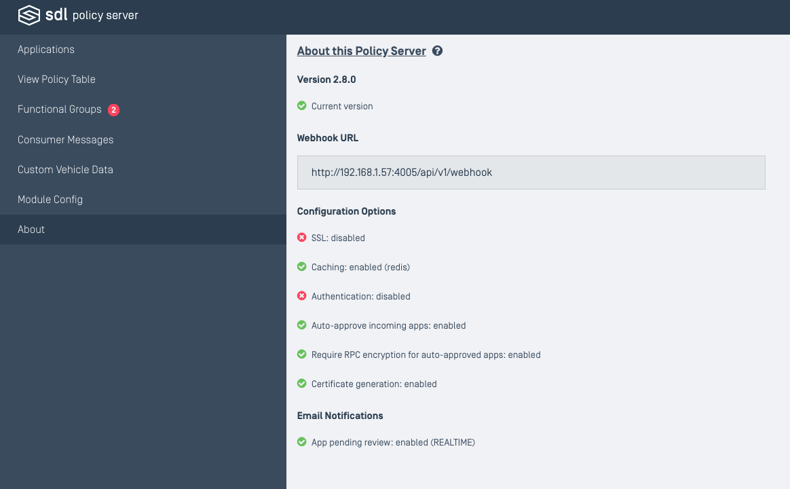

# About

This section provides basic information about your SDL Policy Server's configuration settings, including:

* Currently installed version (and if a new version is available)
* Webhook URL (to be entered on smartdevicelink.com)
* SSL port (if enabled)
* Caching service (if enabled)
* Authentication type (if enabled)
* Auto-approve incoming apps (if enabled)
* Require RPC Encryption for auto-approved apps (if enabled)
* Certificate generation (if enabled)
* Email notifications (if enabled)

