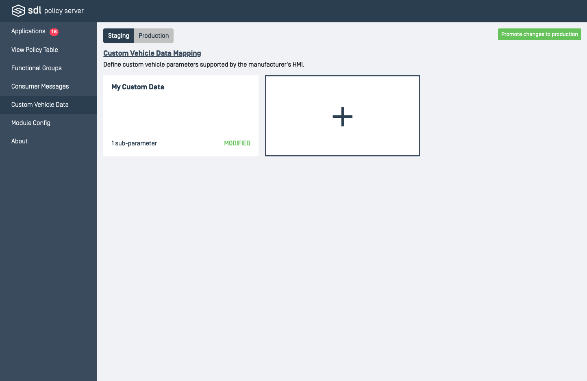
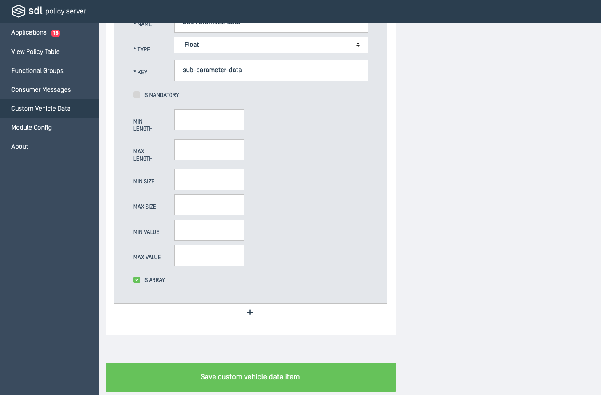
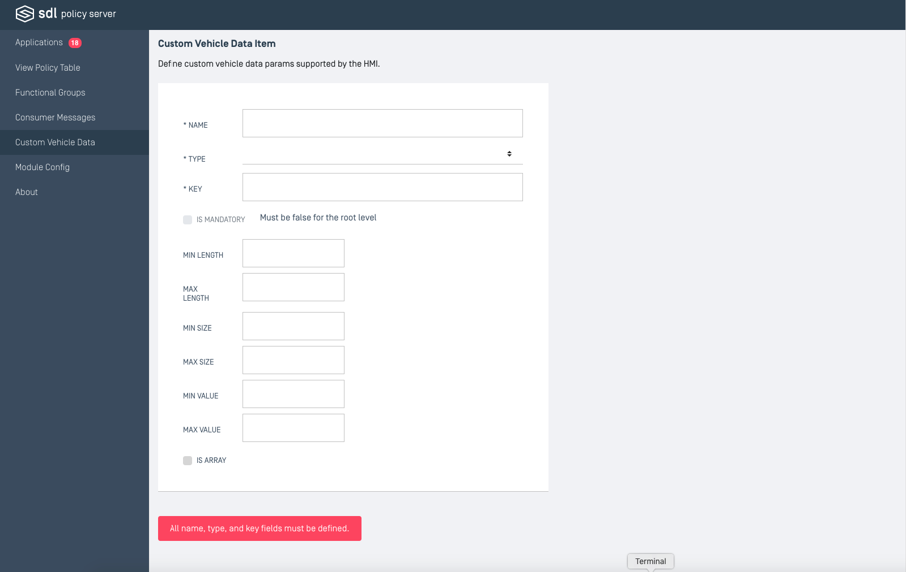

# Custom Vehicle Data
This is where OEM-specific custom vehicle data definitions can be defined and managed. 

## Cards
Each card will have identifying information, which includes the name of the top level vehicle data, and the number of nested parameters it contains. If the information in the card has been altered since the time of creation then it will have a "MODIFIED" tag. All cards are listed in alphabetical order by name.

### Editing
It should be noted that the cards under the "Production" view cannot be edited. If you wish to edit existing cards then you need to be in the "Staging" view and then click on the card. When editing, remember to hit the save button at the bottom of the page to keep any changes.
 

Once a new custom vehicle data item is created, it will be available as an option to assign to vehicle data RPCs in functional groups.

## Properties
| Property | Definition |
|----------|---------|
| Name | The vehicle data item (ex. gps, speed). This is the parameter SDL Core uses for requests. |
| Type | The data type of the vehicle data item. It can be a generic type like Integer or String, or an enumeration defined in the API XML file. For a vehicle data item that has sub parameters, this value would be Struct. |
| Key | A reference to the OEM Network Mapping table which defines the attributes for this vehicle data item. |
| Is Mandatory | Whether this parameter is required to be included for the vehicle data item. |
| Min Length | The minimum length of the value if it is a string. |
| Max Length | The maximum length of the value if it is a string. |
| Min Size | The minimum number of items for the value if it is an array. |
| Max Size | The maximum number of items for the value if it is an array. |
| Min Value | The minimum value for the value if it is a number. |
| Max Value | The minimum value for the value if it is a number. |
| Is Array | Whether this parameter is an array of the specified type. |

### Creating a New Vehicle Data Item
When creating a new functional group, first consider if there should be a user consent prompt associated with the group. If yes, the following diagram will walk through the correct steps.

## Staging 
This environment is where temporary or unfinished entries reside. They can be edited and reworked.

## Production
Only promote entries to production if you are certain that all information associated is correct and final. After promoting to production, changes can not be made to that version of the entry and further changes will need to be made in the staging view.