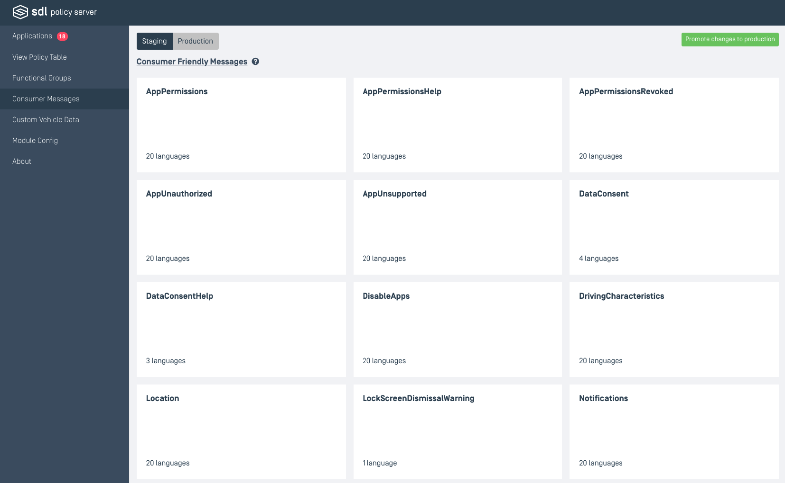
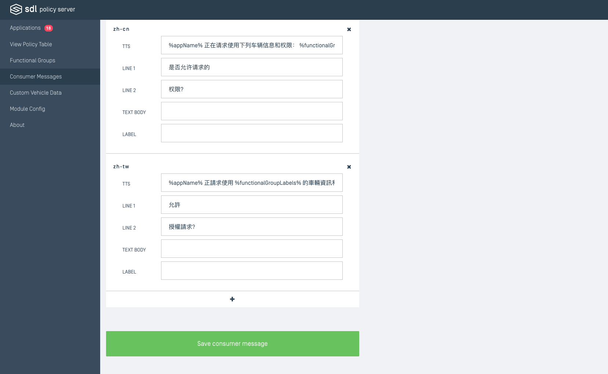
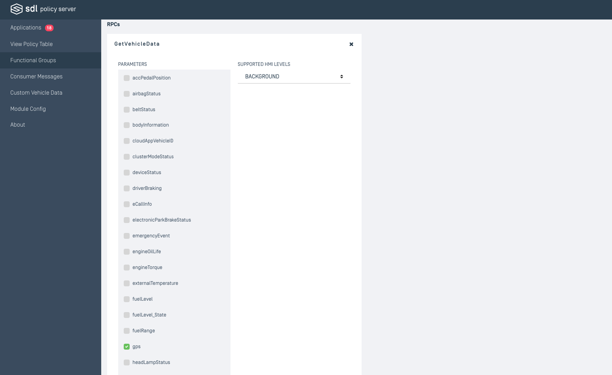
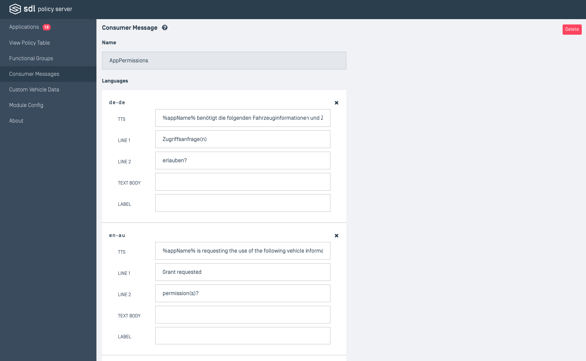

# Consumer Messages & Functional Groups
The pages for displaying lists of consumer messages and functional groups are structured in the same way, using similar Vue.js components. For information on the properties of the consumer messages and functional groups, refer back to the earlier documentation regarding the [Policy Table](../../api-reference-documentation/policy-table/overview/).

## Cards
Each functional group or consumer message card will have identifying information displayed on a card. This information includes the name, and the number of permissions or languages. If the information in the card has been altered since the time of creation then it will have a "MODIFIED" tag. All cards are listed in alphabetical order by name.

### Editing
It should be noted that the cards under "Production" cannot be edited. If you wish to edit an existing functional group that has been set to "Production" then you must edit the staging version of that group. Remember to hit the save button at the bottom of the page to keep any changes.
 

## Functional Groups
| Property | Definition |
|----------|---------|
| Name | The String for which to identify the functional groups. |
| Description | A body of text to outline the permissions associated with this functional group. |
| User Consent Prompt | The consumer friendly message to be displayed when requesting input from the user. |

### Special Grants
| Checkbox | Notes |
|----------|---------|
| Grant this functional group to all applications by default  | If set to true, all staging and accepted applications will have access to this functional group and its permissions. |
| Grant this functional group to all applications prior to the user accepting SDL data consent  |  |
| Grant this functional group to all applications after the user has accepted SDL data consent  |  |
| Grant this functional group to all applications with at least one service provider type  |  |
| Grant this functional group to applications with "Administrator" privileges  |  |
| Grant this functional group to applications with widget management privileges  |  |
| This is a proprietary functional group  |  |

### Encryption
| Checkbox | Notes |
|----------|---------|
| Require RPCs in this functional group to be encrypted   |  |

### RPCs
| Property | Definition |
|----------|---------|
| Parameters | References possible vehicle information that can retrieved. This is only applicable to vehicle data RPCs. eg. GetVehicleData, SubscribeVehicleData |
| Supported HMI Levels | SDL Core interface display levels allowed by the app |

### Creating a New Functional Group
When creating a new functional group, first consider if there should be a user consent prompt associated with the group. If yes, the following diagram will walk through the correct steps.

## Consumer Messages
For information on the language object properties, refer back to the documentation on the <a href="/docs/sdl-server/master/policy-table/consumer-friendly-messages/">consumer messages</a> object.

## Staging 
This environment is where temporary or unfinished entries reside. They can be edited and reworked.

## Production
Production entries are not directly editable and may only be created/edited/deleted by promoting them from the staging entries. Only promote staging entries to production if you are certain that all information associated is correct.