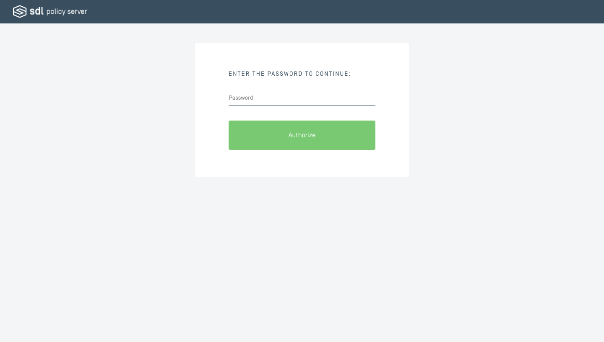

# Security
For your convenience, we have implemented the following security features into the Policy Server.

### HTTPS Connections (SSL/TLS)
HTTPS connections (disabled by default) can be enabled by doing the following:
* Store your SSL Certificate and Private Key files in the `./customizable/ssl` directory
* Set your `POLICY_SERVER_PORT_SSL` environment variable to your desired secure port (typically 443)
* Set your `SSL_CERTIFICATE_FILENAME` environment variable to the filename of your SSL Certificate file
* Set your `SSL_PRIVATE_KEY_FILENAME` environment variable to the filename of your Private Key file
* If  you are unable to modify your environment variables, you may define these settings in the `./settings.js` configuration file
* Restart your Policy Server and navigate to your server's hostname on the secure port!

### Basic Authentication
You may optionally require your Policy Server administrators to enter a password before being able to access the user interface. We recommend using a more secure method of authentication in accordance to your company's IT security standards, but provide this basic authentication feature for convenience.

By default, basic authentication is disabled. To enable it, simply set your `AUTH_TYPE` environment variable to `basic` and your `BASIC_AUTH_PASSWORD` environment variable to a password of your choice, then restart your Policy Server. If you are unable to modify your environment variables, you may define these settings in the `./settings.js` configuration file.

### Policy Table Encryption
You may wish to encrypt your Policy Table when in transit to/from SDL Core. To achieve this, we've implemented skeleton methods to house your custom encryption logic. The Policy Table JSON object (array) is passed to these methods so you can run encryption and decryption transformations against it. By default, these methods perform no transformations.

The customizable Policy Table skeleton `encryptPolicyTable` and `decryptPolicyTable` methods are located in the Policy Server project at the following file path: `./customizable/encryption/index.js`

If you modify this skeleton method to implement Policy Table encryption on your Policy Server, you will also need to implement corresponding cryptography logic via the `crypt` and `decrypt` methods in your build of SDL Core. These methods are available in the `sample_policy_manager.py` [file](https://github.com/smartdevicelink/sdl_core/blob/master/src/appMain/sample_policy_manager.py#L45) of SDL Core.