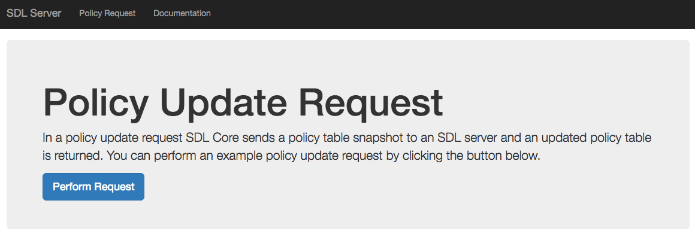

# Installing

#### Node.js & Git

While you can use any programming language and/or framework when creating your SDL Server, our reference application uses javascript and Node.js.

Install [Node.js](https://nodejs.org/en/) and [Git](https://git-scm.com/).

## Reference Documentation
You can find the latest reference documentation in the [SDL Server](/docs/sdl-server/master/overview) section.

## Setup SDL Server

Download or clone the <a href="https://github.com/smartdevicelink/sdl_server" target="_blank">SDL Server git repository</a>.
```
git clone https://github.com/smartdevicelink/sdl_server.git
```

Once cloned, navigate to the repository's root directory and use npm to install the server's dependencies.
```
cd sdl_server && npm install
```

Start the server using npm.
```
npm start
```

Finally, navigate to <a href="http://localhost:3000" target="_blank">localhost:3000</a> in your browser.


Continue on to [Policy Update Request](/guides/sdl-server/policy-update-request/) where you will learn how to connect SDL Core to your local SDL Server.

