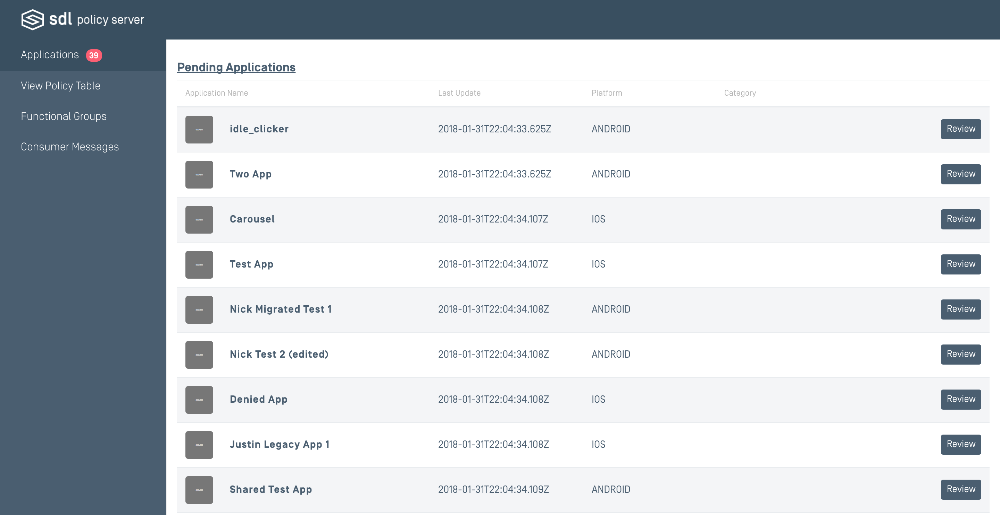
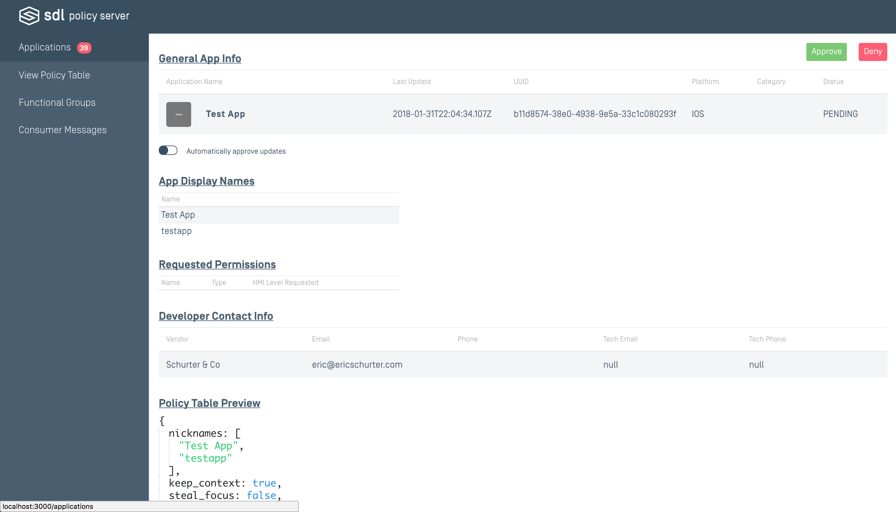

# Applications


This page displays a list of applications pulled from the SHAID server. When initially added, apps will be pending approval. Reviewing each app will give the user a detailed page on the important information associated with the app such as the requested permissions, developer contact information, and preview of what its segment in the Policy Table would look like.

### General App Info


| Property | Definition |
|----------|---------|
| Application Name | The String for which to identify the application. |
| Last Update | The timestamp from when the app information was most recently updated. |
| Platform | Android/IOS |
| Category | Specifies the type of application. eg. Media, Information, Social. |
| State | The approval status of the current application. |

### App Display Names
| Property | Definition |
|----------|---------|
| Name   | Alternate strings to identify the application. The app's name must match one of these in order for it to connect to Core. |

### Requested Permissions
| Property | Definition |
|----------|---------|
| Name | Strings to identify the permission. |
| Type | RPC  |
| HMI Level Requested | BACKGROUND/FULL/NONE/LIMITED   |

### Developer Contact Info
| Property | Definition |
|----------|---------|
| Vendor | The name of the developer to contact with regards to this application. |
| Email | The contact email for the Vendor. |
| Phone | The contact phone number for the Vendor. |
| Tech Email | The optional contact email for technical issues regarding the app. |
| Tech Phone | The optional contact phone number for technical issues. |


### Policy Table Preview
This is an example of how the app and its required permissions will appear in the Policy Table.
```
  {
    nicknames: [
      "App Display Names"
    ],
    keep_context: true,
    steal_focus: true,
    priority: "NONE",
    default_hmi: "NONE",
    groups: [
      "FunctionalGroup1",
      "FunctionalGroup2",
      "FunctionalGroup3"
    ],
    moduleType: [

    ]
  }
```
## Significance of Approval States
The top right corner of the application's review page contains a drop down allowing the user to change the approval state of the application. See below for what each state signifies.

##### Pending
New applications and updated applications that reach your SDL Policy Server will be granted the approval state of pending. Pending applications are treated like limited applications in that they will not be given any changes requested, but will be given permissions in default functional groups. Pending applications require action performed on them in order for the application to be officially approved or limited. 

##### Staging
Applications in the staging state will have their permissions granted when using the staging policy table, but not the production policy table. This mode is useful for testing purposes.

##### Accepted
Applications in the accepted state will have their permissions granted when using both the staging and the production policy table. This state is for applications that are allowed to be used in a production environment. 

##### Limited
Limited applications will not receive their requested changes. However, permissions received from the previously accepted version and from default functional groups will still be given. Additional options include providing a reasoning for limiting the application for your future reference. While in the limited state, you also have the option to blacklist the application.

##### Blacklisted
A blacklisted application will not receive any permissions, including permissions from default functional groups. All future update requests will also be blacklisted. This action is reversible.

## New Application Versions
Each time an app is updated on the SDL Developer Portal at smartdevicelink.com, the app's changes will appear in your Policy Server pending re-approval. If an app is from a trusted developer and you would like to always approve future revisions of it, you can choose to "Automatically approve updates" under "General App Info" of the app's review page.

Newer versions of applications that come in will have a state of pending, but that will not affect the statuses granted to its previously approved versions. The latest permitted application will have their changes used for the policy table until a new version's changes are also permitted.