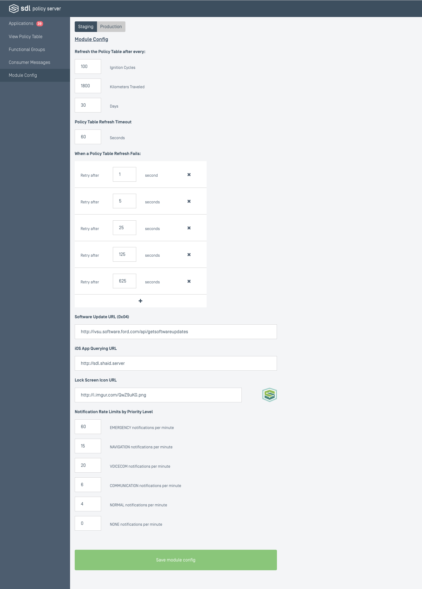

# Module Config

The `module_config` object of the Policy Table is represented here. For information on the properties of the module config, refer back to the earlier documentation regarding the [Policy Table](/docs/sdl-server/master/policy-table/overview/).

## Editing and Saving
The process of editing and saving is very similar to that of functional groups and consumer messages. It is simpler here because the entire object is either in staging or production. Production versions cannot be edited, but can be overwritten by promoting a staging module config. There is no creating or deleting module configs.